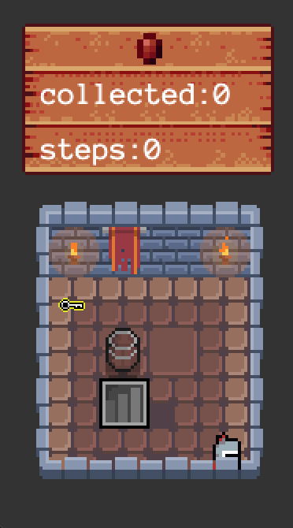
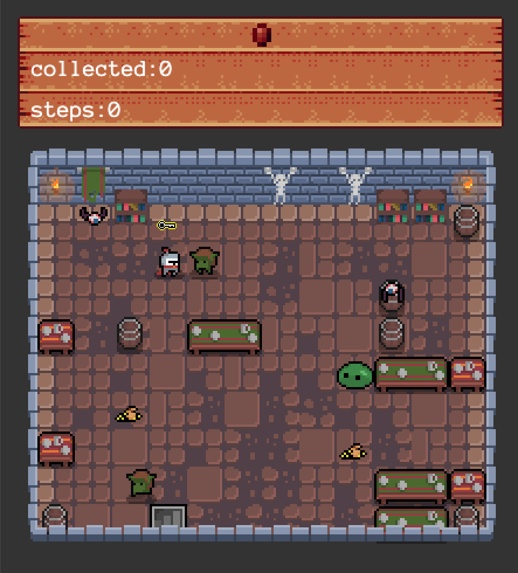
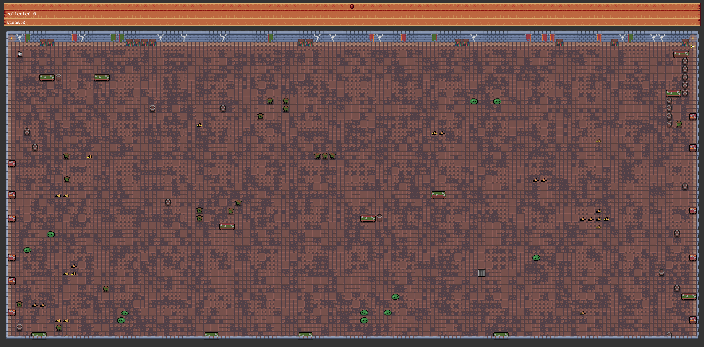
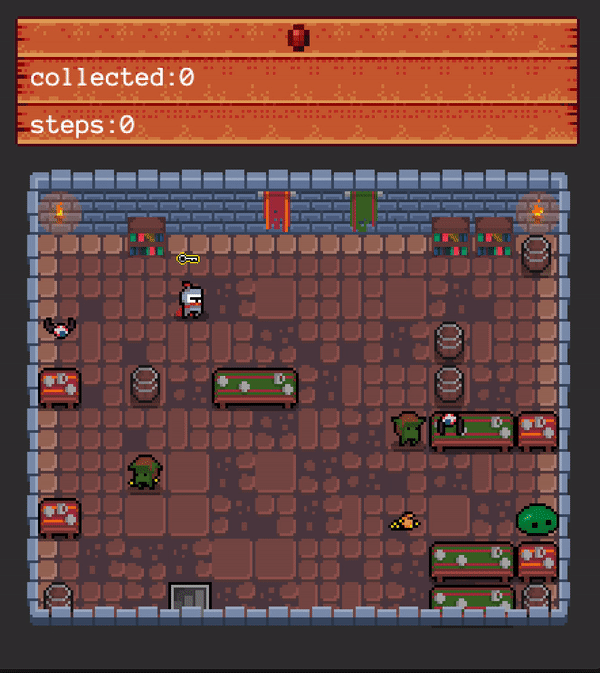

# so-long
A project done at Codam University where the goal was to generate a game from a text file using the c-programming language and a small graphics library.

In the game you play as a knight who's goal it is to collect all gold and a key before running to the exit. In the meanwhile, enemies are walking around to prevent you from obtaining your collectables and finishing the game.


_Thanks to [Leon](https://github.com/W2Wizard) and [Codam](https://www.codam.nl/) for providing the [MLX42 graphics library](https://github.com/codam-coding-college/MLX42) with some handy functions._

## Examples

### Small

| Map  | Game |
| ------------- | ------------- |
| 111111<br>1C0001<br>101001<br>10E001<br>1000P1<br>111111 |   |
| 111111<br>1C0001<br>1GEP01<br>101111<br>1G1111<br>111111 |   |

### Medium

| Map  | Game |
| ------------- | ------------- |
| 11111111111111<br>1001C000001111<br>1F00P0000G0001<br>10000000001001<br>11010110001F01<br>10000000001111<br>100C0000000001<br>110000000CS001<br>1000G000001111<br>1100E000001111<br>11111111111111 |   |

### Large

| Map  | Game |
| ------------- | ------------- |
| ... |   |

## Gameplay

The gameplay is generated based on a text file inputted when starting. Some text files for different use cases are already added to the "maps" folder but you are able to create your own according to the following rules:
- The file has to have the .ber file extension
- The map has to be constructed with 3 components: walls, collectibles, and free space.
- The map has to be rectangular
- The map can be composed of only these 8 characters:
  - 0 for an empty space,
  - 1 for a wall,
  - C for a collectible,
  - E for a map exit,
  - P for the player’s starting position.
  - G for a goblin enemy
  - S for a slime enemy
  - F for a flying enemy
- The map must contain 1 exit, at least 1 collectible, and 1 starting position to be valid.
- The map must be closed/surrounded by walls.
- Every collectable (C) and the exit (E) has to be reachable from the players position.

---



---

## Usage

To run the excecutable you can use the following command:
```
./so_long maps/{name_of_map}
```

An example using one of the existing maps:
```
./so_long maps/weirdo.ber
```
